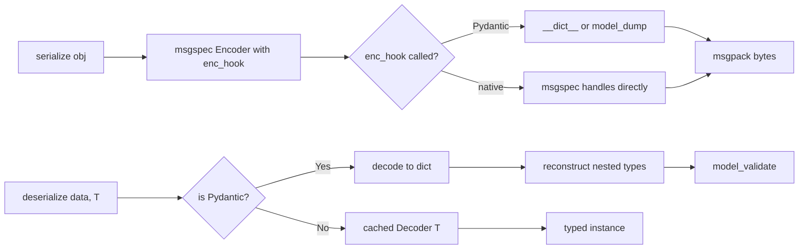

# feat: Unified Python Serializer with msgspec Backend

## Overview

Build a `Serializer` class that provides `serialize()` and `deserialize()` static methods for any supported Python type via MessagePack. msgspec handles the heavy lifting for all natively supported types (primitives, collections, dataclasses, stdlib types). The library's core value is transparent Pydantic BaseModel support and a unified dispatch API across all model systems.

## Problem Frame

Python developers mixing Pydantic BaseModels, msgspec Structs, dataclasses, and stdlib types in IPC scenarios need manual conversion glue. This library eliminates that by auto-detecting the type system and dispatching to the optimal serialization path. (see origin: `docs/brainstorms/unified-serializer-requirements.md`)

## Requirements Trace

- R1. `Serializer.serialize(obj) -> bytes` — static method, MessagePack output
- R2. `Serializer.deserialize(data, target_type) -> T` — static method, schema-aware
- R3. `Serializer` class as namespace, no instantiation needed, internal caching transparent
- R4. Auto-detect Pydantic BaseModel, msgspec Struct, dataclass, primitive/stdlib types
- R5. Dispatch to fastest path per type system
- R6. Primitives: str, int, float, bool, None, bytes
- R7. Collections: list, dict, tuple
- R10. Structured types: Pydantic BaseModel, msgspec Struct, dataclass
- R12. Zero-overhead path for msgspec-native types (direct pass-through). Note: the origin doc's R12 listed set/frozenset/deque/Decimal/timedelta as requiring enc_hook — this was based on incomplete research and is superseded by Context & Research findings confirming all these types are native in msgspec.
- R13. Pydantic models with minimal conversion overhead
- R14. Type-dispatch results cached

## Scope Boundaries

- MessagePack only (no JSON, Protobuf)
- Schema-aware deserialization (target type always required)
- No numpy, no arbitrary custom classes
- No streaming — full objects serialized at once
- MVP scope: all msgspec-native types (primitives, collections incl. set/frozenset, datetime/UUID/Decimal/Enum, dataclasses, NamedTuple, TypedDict, msgspec Structs) plus Pydantic BaseModels. Pydantic models with nested Pydantic or dataclass children are included.
- Phase 2 (deferred): Union/Optional type disambiguation strategies, complex heterogeneous collections (e.g., `list[Pydantic | Struct]`), advanced Pydantic features (custom serializers, complex alias mappings)

## Context & Research

### Critical Finding: msgspec Native Type Coverage

Research revealed that msgspec natively supports **far more types** than the requirements document assumed:

| Category | Types | Native in msgspec? |
|----------|-------|--------------------|
| Primitives | str, int, float, bool, None, bytes | Yes |
| Collections | list, dict, tuple, set, frozenset | Yes |
| Datetime | datetime, date, time, timedelta | Yes |
| Stdlib | UUID, Decimal, Enum | Yes |
| Structured | msgspec.Struct, dataclass, NamedTuple, TypedDict | Yes |
| Typing | Optional, Union, Literal, generics | Yes |
| **Not native** | **Pydantic BaseModel** | **No — requires enc_hook/dec_hook** |

This means the library's actual work is a thin Pydantic adapter layer on top of msgspec. All other types pass through with zero overhead.

### msgspec API Surface

- `msgspec.msgpack.Encoder(enc_hook=..., decimal_format=..., order=...)` — reusable, thread-safe encoder
- `msgspec.msgpack.Decoder(type=T, dec_hook=...)` — pre-compiled decoder for type T, reusable
- `msgspec.convert(obj, type, from_attributes=True)` — can bridge attribute-based objects (Pydantic) to Structs
- `enc_hook(obj) -> native_type` — called for any type msgspec can't handle natively
- `dec_hook(type, obj) -> instance` — called during decoding when target type isn't native

### Pydantic Conversion Path (Resolved)

- **Serialize:** `obj.__dict__` is faster than `model_dump()` for field extraction (avoids pydantic-core's recursive serialization pipeline). Nested Pydantic models handled recursively via enc_hook.
- **Deserialize:** Decode MessagePack to dict via msgspec, then `Model(**decoded_dict)` or `model_validate(decoded_dict)`. Use `model_construct()` only if validation is explicitly skipped.
- **Decision:** Use `model_validate()` for correctness guarantees on deserialization. The overhead vs `model_construct()` is acceptable given the IPC context where data integrity matters.

### Caching Strategy (Resolved)

Plain `dict[type, Callable]` lookup is fastest — single hash table lookup in C, no function call overhead. `lru_cache` adds ~50-100ns. `singledispatch` does MRO walking, slower.

### External References

- [msgspec Extending (enc_hook/dec_hook)](https://jcristharif.com/msgspec/extending.html)
- [msgspec Supported Types](https://jcristharif.com/msgspec/supported-types.html)
- [msgspec Converters](https://jcristharif.com/msgspec/converters.html)
- [Pydantic v2 Serialization](https://docs.pydantic.dev/latest/concepts/serialization/)

## Key Technical Decisions

- **`obj.__dict__` over `model_dump()` for Pydantic serialization:** ~2-5x faster for flat models. enc_hook recursively handles nested Pydantic models. (see origin: deferred question on R13)
- **`model_validate()` for Pydantic deserialization:** Correctness over raw speed. In IPC context, data integrity matters. Can be swapped for `model_construct()` later as opt-in if needed.
- **Plain dict for type-dispatch cache:** Fastest option confirmed by research. Keyed by `type(obj)` for serialize, by `target_type` for deserialize.
- **Reusable Encoder/Decoder instances:** msgspec Encoder and Decoder are thread-safe and pre-compile paths. Create one Encoder (with enc_hook) and cache Decoders per target type.
- **Decimal/datetime handled natively by msgspec:** No custom enc_hook needed. datetime is encoded as ISO 8601 string (not MessagePack Timestamp extension). Decimal format configurable. Untyped decode returns strings for datetime/UUID/Decimal, which is acceptable because Pydantic's model_validate coerces strings to correct types, and typed Decoders handle the conversion for non-Pydantic paths.
- **`threading.Lock` for cache writes:** Future-proofs for free-threaded Python (PEP 703 / Python 3.13+). Negligible overhead since cache misses are rare after warmup.
- **Custom exception hierarchy:** `SerializerError` as base, `SerializeError` and `DeserializeError` as subclasses. Backend exceptions (msgspec, Pydantic) wrapped with `__cause__` for debuggability. Unified API = unified errors.
- **Serialize path uses enc_hook only, no pre-dispatch:** The type-dispatch cache is only needed for deserialization (choosing Pydantic path vs native Decoder). For serialization, the shared Encoder's enc_hook handles Pydantic transparently — no type pre-classification needed.

## Open Questions

### Resolved During Planning

- **Pydantic conversion path:** `__dict__` for serialize, `model_validate()` for deserialize (see Key Technical Decisions)
- **Decimal/datetime representation:** msgspec handles both natively — no custom encoding needed
- **Caching strategy:** Plain dict lookup (see Key Technical Decisions)
- **deque/set/frozenset:** msgspec handles natively — moves from Phase 2 concern to trivial

### Deferred to Implementation

- **Nested Pydantic with non-Pydantic children:** The enc_hook recursion needs testing to confirm it handles Pydantic→dataclass→Pydantic nesting correctly. If msgspec's enc_hook is only called for non-native types, nested dataclasses within Pydantic models should serialize fine (msgspec handles dataclasses natively after __dict__ extraction).
- **Pydantic field aliases:** `__dict__` uses Python attribute names, not Pydantic aliases. Need to verify this is consistent between serialize and deserialize paths.
- **Datetime in untyped decode path:** Verify that `msgspec.msgpack.decode(data)` (untyped) correctly converts MessagePack Timestamp extension to `datetime` objects. If not, the Pydantic decode path needs a typed intermediate decode step or post-decode conversion.

## High-Level Technical Design

> *This illustrates the intended approach and is directional guidance for review, not implementation specification. The implementing agent should treat it as context, not code to reproduce.*

```
Serializer.serialize(obj):
  1. Always encode via shared msgspec.msgpack.Encoder (with enc_hook)
  2. enc_hook handles Pydantic models transparently — no pre-dispatch needed
  3. For Pydantic: enc_hook returns __dict__ (or model_dump for complex models)
  4. msgspec calls enc_hook recursively for any nested non-native types

Serializer.deserialize(data, target_type):
  1. Check dispatch cache for target_type (with threading.Lock on cache writes)
  2. If miss: classify target_type → {pydantic, native}
     - pydantic: decode to dict via msgspec, walk type annotations to reconstruct
       nested non-Pydantic types, then model_validate()
     - native: create msgspec.msgpack.Decoder(type=target_type), cache it
  3. Decode data using the appropriate path
  4. Wrap errors in SerializeError/DeserializeError with original as __cause__
```



## Implementation Units

- [ ] **Unit 1: Project Scaffolding**

**Goal:** Set up the Python package structure with pyproject.toml, source layout, and dev dependencies.

**Requirements:** Foundation for all other units

**Dependencies:** None

**Files:**
- Create: `pyproject.toml`
- Create: `src/serializer/__init__.py`
- Create: `src/serializer/py.typed`
- Create: `tests/__init__.py`
- Create: `tests/conftest.py`

**Approach:**
- Use `src/` layout for clean packaging
- `msgspec` as required dependency, `pydantic` as optional (`[pydantic]` extra)
- `pytest` and `pydantic` as dev dependencies
- Python 3.10+ in `requires-python`
- Package name: `serializer`

**Patterns to follow:**
- Standard modern Python packaging with pyproject.toml (PEP 621)

**Test expectation:** none — scaffolding only

**Verification:**
- `pip install -e ".[dev]"` succeeds
- `python -c "import serializer"` works

---

- [ ] **Unit 2: Type Detection and Dispatch Cache**

**Goal:** Build the type classification system that determines the serialization path for any given type. Cache results for repeat calls.

**Requirements:** R4, R5, R14

**Dependencies:** Unit 1

**Files:**
- Create: `src/serializer/_dispatch.py`
- Test: `tests/test_dispatch.py`

**Approach:**
- Detect Pydantic via `isinstance(obj, pydantic.BaseModel)` with lazy import guard (try/except ImportError)
- Detect msgspec Struct via `isinstance(obj, msgspec.Struct)`
- Detect dataclass via `dataclasses.is_dataclass(obj)`
- Everything else is "native" — let msgspec handle it
- Cache: `dict[type, TypeCategory]` where TypeCategory is an enum (PYDANTIC, NATIVE)
- msgspec Structs and dataclasses are both NATIVE (msgspec handles them directly)
- For deserialization, classify `target_type` instead of `type(obj)`
- Pydantic detection must handle missing pydantic gracefully: if not installed, duck-type check for `model_validate` and `model_fields` attributes — if present, raise `ImportError` with install hint rather than classifying as NATIVE (which would produce confusing msgspec errors)

**Patterns to follow:**
- Plain dict cache as resolved in planning
- Lazy import pattern for optional dependencies

**Test scenarios:**
- Happy path: classify a Pydantic model → PYDANTIC
- Happy path: classify a msgspec Struct → NATIVE
- Happy path: classify a dataclass → NATIVE
- Happy path: classify a primitive (int, str) → NATIVE
- Happy path: classify a dict/list → NATIVE
- Edge case: second call for same type hits cache (verify no re-computation)
- Edge case: classify when pydantic not installed → never returns PYDANTIC
- Error path: None value classified correctly (NoneType → NATIVE)

**Verification:**
- All type categories correctly identified
- Cache hit confirmed on repeated calls
- No ImportError when pydantic is absent

---

- [ ] **Unit 3: Pydantic Encoding (enc_hook)**

**Goal:** Implement the enc_hook function that converts Pydantic BaseModels to msgspec-encodable dicts for serialization.

**Requirements:** R1, R10, R13

**Dependencies:** Unit 2

**Files:**
- Create: `src/serializer/_pydantic.py`
- Test: `tests/test_pydantic_encode.py`

**Approach:**
- enc_hook receives any object msgspec can't natively encode
- Check if it's a Pydantic BaseModel:
  - At classification time (Unit 2), inspect `model_computed_fields` and `model_config.get('extra')` to determine if `__dict__` is sufficient or if `model_dump(mode='python')` is needed. Cache this decision.
  - For simple models (no computed fields, no extra='allow'): return `obj.__dict__` (fast path)
  - For models with computed fields or extra='allow': merge via `{**obj.__dict__, **(obj.__pydantic_extra__ or {})}` (None guard required since `__pydantic_extra__` is None when no extras provided), add computed field values. If too complex, fall back to `model_dump(mode='python')`
- For nested Pydantic models inside __dict__ values: msgspec's encoder will call enc_hook again for each non-native value, so recursion is handled automatically
- If the object is not Pydantic, raise `TypeError` with descriptive message
- Create a shared `msgspec.msgpack.Encoder(enc_hook=pydantic_enc_hook)` instance

**Patterns to follow:**
- msgspec enc_hook pattern from official docs

**Test scenarios:**
- Happy path: flat Pydantic model with str/int fields → correct msgpack bytes that decode to matching dict
- Happy path: Pydantic model with nested dataclass field → both serialized correctly (dataclass handled natively by msgspec)
- Happy path: Pydantic model with nested Pydantic model → both converted via enc_hook
- Happy path: Pydantic model with `@computed_field` → computed field values included in output
- Happy path: Pydantic model with `extra='allow'` and extra fields → extra fields preserved
- Edge case: Pydantic model with None field values → encoded correctly
- Edge case: Pydantic model with bytes field → bytes preserved
- Error path: unsupported type passed to enc_hook → descriptive TypeError raised
- Integration: encoded bytes can be decoded by raw msgspec decoder to dict → field values match original

**Verification:**
- Pydantic models of varying complexity serialize to valid MessagePack bytes
- Nested Pydantic models handled recursively without stack overflow for reasonable depth

---

- [ ] **Unit 4: Pydantic Decoding**

**Goal:** Implement deserialization path for Pydantic BaseModels — decode MessagePack to dict, then reconstruct the model.

**Requirements:** R2, R10, R13

**Dependencies:** Units 2, 3

**Files:**
- Create: `src/serializer/_pydantic.py` (extend)
- Test: `tests/test_pydantic_decode.py`

**Approach:**
- For Pydantic target types: decode bytes to dict using `msgspec.msgpack.decode(data)`
- Before passing to `model_validate()`: walk the Pydantic model's field annotations to identify nested msgspec Struct fields. For each such field, use `msgspec.convert(field_value, FieldType)` to reconstruct the typed Struct from the raw dict. Note: nested dataclasses and nested Pydantic models do NOT need this treatment — Pydantic's model_validate already reconstructs them from dicts natively. Only msgspec Structs require explicit conversion.
- Reconstruct via `target_type.model_validate(prepared_dict)`
- Cache: store `is_pydantic` classification per target_type (from Unit 2), plus a pre-computed map of fields that need nested type reconstruction
- For non-Pydantic targets: use cached `msgspec.msgpack.Decoder(type=target_type)`
- Decoder instances are expensive to create but fast to reuse — cache one per target_type
- All cache writes protected by `threading.Lock`
- Spike: verify that `msgspec.msgpack.decode(data)` (untyped) correctly handles datetime/UUID/Decimal fields. If not, use a typed Decoder with `type=dict` or build an intermediate schema.

**Patterns to follow:**
- Pydantic model_validate() for safe reconstruction
- msgspec Decoder caching pattern
- msgspec.convert() for dict-to-typed-object conversion

**Test scenarios:**
- Happy path: deserialize bytes into flat Pydantic model → all fields match original
- Happy path: deserialize into Pydantic model with nested Pydantic model → nested model reconstructed
- Happy path: deserialize into Pydantic model with nested dataclass → dataclass correctly reconstructed (not left as raw dict)
- Happy path: deserialize into Pydantic model with datetime field → datetime object (not raw extension bytes)
- Edge case: extra fields in bytes that aren't in model → Pydantic handles via model_config
- Error path: bytes decoded to dict missing required field → DeserializeError raised (wrapping Pydantic ValidationError)
- Error path: bytes decoded to dict with wrong field types → DeserializeError raised
- Error path: invalid MessagePack bytes → DeserializeError raised (wrapping msgspec DecodeError)
- Integration: full roundtrip Pydantic model with nested dataclass → serialize → deserialize → equals original

**Verification:**
- Roundtrip equality for Pydantic models of varying complexity
- Validation errors from Pydantic are propagated with useful context

---

- [ ] **Unit 5: Serializer Class (Public API)**

**Goal:** Assemble the public `Serializer` class with `serialize()` and `deserialize()` static methods.

**Requirements:** R1, R2, R3, R4, R5, R6, R7, R12

**Dependencies:** Units 3, 4 (Unit 2 is a transitive dependency via Unit 4)

**Files:**
- Create: `src/serializer/_exceptions.py`
- Create: `src/serializer/_core.py`
- Modify: `src/serializer/__init__.py` (export Serializer + exceptions)
- Test: `tests/test_serializer.py`

**Approach:**
- `Serializer` class with `@staticmethod` methods
- `serialize(obj)`: call shared Encoder directly — enc_hook handles Pydantic transparently, no pre-dispatch needed. Wrap errors in `SerializeError`.
- `deserialize(data, target_type)`: use dispatch cache (with `threading.Lock`) to classify target, decode via Pydantic path or cached native Decoder. Wrap errors in `DeserializeError`.
- Module-level shared Encoder instance (thread-safe, reusable)
- Module-level decoder cache: `dict[type, msgspec.msgpack.Decoder]`, writes protected by `threading.Lock`
- Export `Serializer`, `SerializerError`, `SerializeError`, `DeserializeError` from `__init__.py`
- Create `src/serializer/_exceptions.py` for exception hierarchy

**Patterns to follow:**
- Namespace class pattern with static methods
- Module-level singletons for Encoder and cache

**Test scenarios:**
- Happy path: `Serializer.serialize(42)` → bytes, `Serializer.deserialize(bytes, int)` → 42
- Happy path: roundtrip for str, float, bool, None, bytes
- Happy path: roundtrip for list, dict, tuple
- Happy path: roundtrip for msgspec Struct
- Happy path: roundtrip for dataclass
- Happy path: roundtrip for Pydantic BaseModel
- Happy path: roundtrip for nested dataclass inside Pydantic model
- Edge case: empty dict, empty list, empty bytes
- Edge case: large nested structure (dict of lists of dicts)
- Edge case: dataclass with default values
- Error path: `Serializer.serialize(object())` → SerializeError wrapping TypeError, message names the type
- Error path: `Serializer.deserialize(b"invalid", int)` → DeserializeError wrapping msgspec DecodeError
- Error path: `Serializer.deserialize(valid_bytes, WrongType)` → DeserializeError with descriptive message
- Error path: Pydantic model passed without pydantic installed → ImportError with install hint
- Integration: serialize Pydantic model on "sender" side, deserialize on "receiver" side with same type → equal

**Verification:**
- All supported MVP types roundtrip correctly
- Error messages are clear and actionable
- `from serializer import Serializer` works cleanly

---

- [ ] **Unit 6: Benchmarks**

**Goal:** Create benchmark suite to validate performance claims against success criteria.

**Requirements:** R12 (<5% overhead for Structs), R13 (Pydantic parity), success criteria (<15% for dataclasses)

**Dependencies:** Unit 5

**Files:**
- Create: `benchmarks/bench_serialize.py`

**Approach:**
- Use `timeit` or `pyperf` for reliable microbenchmarks
- Compare: native `msgspec.msgpack.encode(struct)` vs `Serializer.serialize(struct)`
- Compare: native `msgspec.msgpack.encode(dataclass_obj)` vs `Serializer.serialize(dataclass_obj)`
- Compare: `pydantic_obj.model_dump()` + `msgspec.msgpack.encode(dict)` vs `Serializer.serialize(pydantic_obj)`
- Measure cold (first call) and warm (cached) performance
- Test with varying payload sizes (small: 5 fields, medium: 20 fields, large: nested)

**Patterns to follow:**
- Standard Python benchmarking with warmup iterations

**Test expectation:** none — benchmarks are measurement, not assertions. Performance targets are validated manually.

**Verification:**
- Benchmark results printed in readable table format
- msgspec Struct overhead is within 5% of native
- Dataclass overhead is within 15% of native
- Pydantic path is at parity with model_dump() + msgspec encode

## System-Wide Impact

- **Interaction graph:** Library is self-contained. No callbacks, middleware, or external side effects. enc_hook is called internally by msgspec Encoder.
- **Error propagation:** All errors wrapped in `SerializeError` or `DeserializeError` with original exception as `__cause__`. Callers catch one exception hierarchy (`SerializerError`) regardless of backend. Original exceptions (msgspec.DecodeError, pydantic.ValidationError) accessible via `__cause__` for debugging.
- **State lifecycle risks:** Module-level Encoder and decoder cache are shared state. Cache is append-only (never evicted), so no invalidation issues for static type definitions. Dynamic type creation (rare) would grow the cache unboundedly but is acceptable for typical usage.
- **API surface parity:** serialize() handles all types symmetrically. deserialize() requires target_type for all types (no asymmetry in API).
- **Unchanged invariants:** msgspec's native encoding behavior is not modified — the library delegates to msgspec for all non-Pydantic types without transformation.

## Risks & Dependencies

| Risk | Mitigation |
|------|------------|
| `obj.__dict__` may not match `model_dump()` for Pydantic models with aliases, validators, or computed fields | Start with `__dict__`, fall back to `model_dump(mode='python')` if alias/computed field detection finds mismatches. Test both paths. |
| msgspec Decoder cache grows unboundedly with dynamic types | Acceptable for typical IPC usage. Document that dynamic type creation (e.g., `create_model()` in loops) is not the intended use case. |
| Pydantic v2 internal API changes across minor versions | Pin `pydantic>=2.0` in optional deps. Only use public API (`model_validate`, `__dict__`, `model_fields`). |
| msgspec single-maintainer project | Runtime dependency is unavoidable for the backend choice. Keep the adapter layer thin so switching backends is feasible if needed. |

## Sources & References

- **Origin document:** [docs/brainstorms/unified-serializer-requirements.md](docs/brainstorms/unified-serializer-requirements.md)
- External: [msgspec Supported Types](https://jcristharif.com/msgspec/supported-types.html)
- External: [msgspec Extending](https://jcristharif.com/msgspec/extending.html)
- External: [Pydantic v2 Serialization](https://docs.pydantic.dev/latest/concepts/serialization/)
